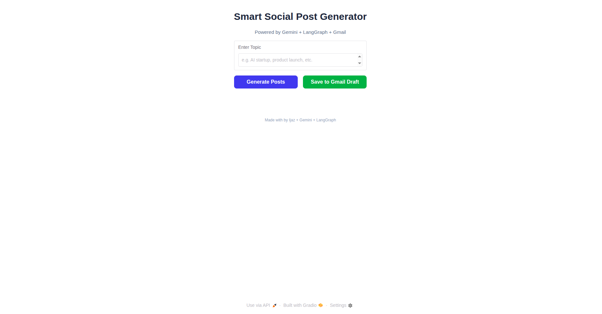

# Multi-Agent-System - Social Media Post Generator

AI-powered multi-agent system for automatic social content generation, evaluation, and posting. Built with LangGraph, Gemini, Gradio, and Gmail API.


## Overview

This project uses an AI-driven multi-agent workflow to:
  1. Generate engaging social media content based on a user’s topic.
  2. Evaluate and improve the generated content until it meets quality criteria.
  3. Generate platform-specific posts for LinkedIn, Facebook, and X (Twitter).
  4. save the generated posts as a Gmail draft for review or scheduling.
  5. Provide a beautiful Gradio-based UI with smooth animations and live feedback.

## Agents:
  1. Generator: Creates engaging content from the topic.
  2. Evaluator: Reviews content and loops back for improvements.
  3. Post Generator: Produces structured posts for social platforms.
  4. Gmail Agent: Saves the final result to your Gmail drafts.

## Project Structure
```bash
project/
│
├── agent.py         # Core logic (LangGraph + Gemini + Gmail)
├── ui.py            # Beautiful Gradio UI frontend
├── token.pkl        # Gmail OAuth credentials (auto-generated) - use your own file
├── requirements.txt # Dependencies list
└── README.md        # Project documentation
```
## Installation
### clone repo
```bash
git clone https://github.com/yourusername/social-media-agent.git
cd social-media-agent
```

### Create Virtual Environment
```bash
python -m venv .venv
source .venv/bin/activate  # (Linux/Mac)
.venv\Scripts\activate     # (Windows)
```
### Run the setup
Do not forget to downnload your email credentials as credentials.json
```bash
python ui.py
```
### Install dependencies

```bash
pip install -r requirements.txt
```
### UI Preview


